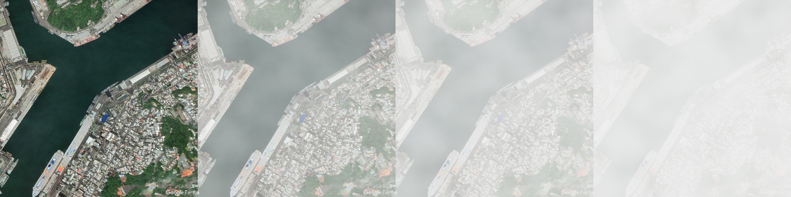
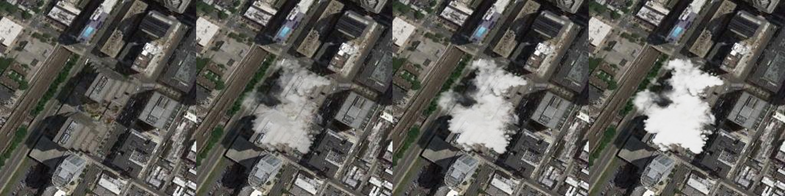
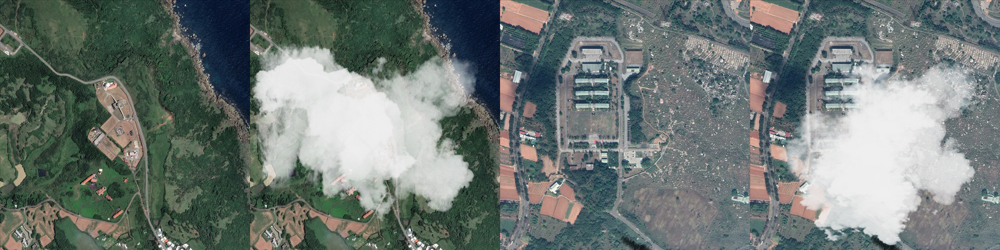

# Introduction
This is a simulator that generates foggy, rainy, smoky and cloudy image over a clear remote sensing image.

# Preparation
### Create a Virtual Environment
Run ``pip install -r requirements.txt``.

### Generate Foggy, Rainy and Cloudy Images
Just put the images into the folder ***data/raw***.

### Generate Smoky Images
Besides prepare images, you should also prepare labels corresponding to every image in YOLO format, and put them into
the folder ***data/labels***.

# Usage

### Generate Foggy Images
Use command ``python simulate.py --foggy --light --medium --heavy``. Parameters *light / medium / heavy* control the thickness 
of the fog. Note that you should at least use one parameter, or there will be no output. Output images will be in the folder
***data/foggy***.

This method is modified from [FoHIS](https://github.com/noahzn/FoHIS).

### Generate Rainy Images
Use command ``Python simulate.py --rainy``. Output images will be in the folder ***data/rainy***.

### Generate Smoky Images
Use command ``python simulate.py --smoky --light --medium --heavy``. The usage of the last three parameters is same to 
that in generating foggy images. Output images will be in the folder ***data/smoky***.

### Generate Cloudy Images
Use command ``Python simulate.py --cloudy``. Output images will be in the folder ***data/cloudy***.

# Demonstration

### Foggy Simulation
From left to right is **original image**, **image with light fog**, **image with medium fog** and **image with heavy fog**
respectively.


### Rainy Simulation
From left to right is **original image**, **image with light rain** and **image with heavy rain** respectively. 
The heavy rain simulation is **not included** in the code because it's not quite real.


### Smoke Simulation
From left to right is **original image**, **image with light smoke**, **image with medium smoke** and **image with heavy smoke**
respectively.


### Cloudy Simulation
From left to right is **original image**, **image with clouds**. We demonstrate two examples here.


# Cite
If you found this repository useful, please consider citing this repository:
```
@misc{Runou2023,
  author = {Runou Yang},
  title = {AdverseWeatherSimulation},
  year = {2023},
  publisher = {GitHub},
  journal = {GitHub repository},
  howpublished = {\url{https://github.com/RicardooYoung/AdverseWeatherSimulation}},
}
```
